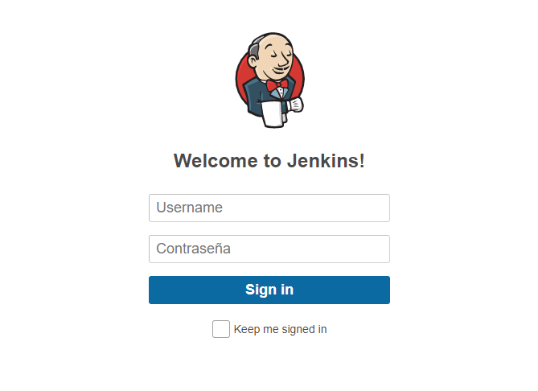
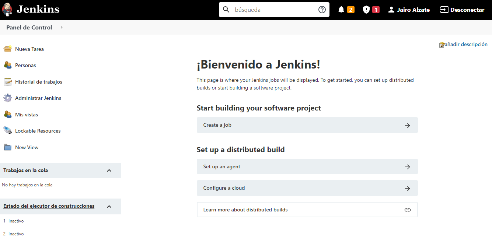

# Docker

## Clase del 19 de Julio del 2021

Docker es una herramienta que facilita el despliegue de aplicaciones de una forma muy rapida.
Esto permite que el tiempo entre la codificación del codigo e implementarlo, ya sea para realizar pruebas o ya para producción sea mucho mas sencillo.
Docker trabaja mediante contenedores, el cual es simplemente un tipo de almacenamiento liviano, el los cuales se puede guardar todas las dependencias que nuestra apliacion necesite para ejecutarse correctamente. Esto permite que estos no necesiten de un hipervisor, si no que  se puedan ejecutar directamente en el nucleo de la maquina host.
Esto conlleva que necesitemos muchos menos recursos de hardware que si tuvieras que utilizar maquinas virtuales, aunque estos mismos contenedores se guarden en maquinas virtuales proporcionadas por plataformas como AWS, Microsoft Azure o Google Cloud. Con ayuda de estas plataformas podemos poner a correr muchos contenedores a la vez.

Con ayuda de docker podemos realizar la entrega rapida y consistente de aplicaciones, puesto que, optimiza el ciclo de vida del desarrollo del software, esto porque nos crea entornos estandarizados y tambien nos ayuda con la integración continua de la apliaciones.

Entonces Docker nos permite que, un grupo de desarrolladores generen codigo en contenedores y lo compartan con otras personas, estas verfirican y encuentran si encuentran errores los corregien y los vuelven a subir al entorno de pruebas y validación, y pasando esto, la aplicación ya estaria lista para el usuario final.

Docker utiliza herramientas tales como: 
 * Kubernetes
 * Swarm 
 * Mesosphere Datacenter (DC/OS)
 * Google Kubernetes Engine

## Clase del 21 de Julio del 2021

### Instalación de Docker

Iniciamos con la instalación de Docker dentro de una maquina virtual Ubuntu con los siguientes comandos: 

`sudo apt-get update` - > Esto para actualizar los paquetes del Ubuntu

`sudo apt-get install \
    apt-transport-https \
    ca-certificates \
    curl \
    gnupg \
    lsb-release` -> Esto para instalar los paquetes necesarios para la instalación.
 
Añadimos la llave GPG del docker con el siguiente comando: `curl -fsSL https://download.docker.com/linux/ubuntu/gpg | sudo gpg --dearmor -o /usr/share/keyrings/docker-archive-keyring.gpg`.
 
Utilizamos el siguiente comando para configurar el repositorio estable: `echo \
  "deb [arch=amd64 signed-by=/usr/share/keyrings/docker-archive-keyring.gpg] https://download.docker.com/linux/ubuntu \
  $(lsb_release -cs) stable" | sudo tee /etc/apt/sources.list.d/docker.list > /dev/null`

### Instalar Docker Engine 

Lo hacemos con el siguiente comando: `sudo apt-get install docker-ce docker-ce-cli containerd.io`

Una vez tengamos esto podemos realizar la prueba del "Hola mundo" con el siguiente comando: `sudo docker run hello-world` y obtenemos el siguiente resultado:

        ** 
        Hello from Docker!
            This message shows that your installation appears to be working correctly.

            To generate this message, Docker took the following steps:
            1. The Docker client contacted the Docker daemon.
            2. The Docker daemon pulled the "hello-world" image from the Docker Hub.
            (amd64)
            3. The Docker daemon created a new container from that image which runs the
            executable that produces the output you are currently reading.
            4. The Docker daemon streamed that output to the Docker client, which sent it
            to your terminal.

            To try something more ambitious, you can run an Ubuntu container with:
            $ docker run -it ubuntu bash

            Share images, automate workflows, and more with a free Docker ID:
            https://hub.docker.com/

            For more examples and ideas, visit:
            https://docs.docker.com/get-started/
        **

Para saber que version de docker instalamos en nuestro sistema utilizamos el siguiente comando: `sudo docker version` y obtenemos lo siguiente: 

        ** 
        Client: Docker Engine - Community
        Version:           20.10.7
        API version:       1.41
        Go version:        go1.13.15
        Git commit:        f0df350
        Built:             Wed Jun  2 11:56:38 2021
        OS/Arch:           linux/amd64
        Context:           default
        Experimental:      true

        Server: Docker Engine - Community
        Engine:
        Version:          20.10.7
        API version:      1.41 (minimum version 1.12)
        Go version:       go1.13.15
        Git commit:       b0f5bc3
        Built:            Wed Jun  2 11:54:50 2021
        OS/Arch:          linux/amd64
        Experimental:     false
        containerd:
        Version:          1.4.8
        GitCommit:        7eba5930496d9bbe375fdf71603e610ad737d2b2
        runc:
        Version:          1.0.0
        GitCommit:        v1.0.0-0-g84113ee
        docker-init:
        Version:          0.19.0
        GitCommit:        de40ad0
        **
 
### Docker Compose

Ejecutamos este comando para descargar la versión estable actual de Docker Compose: `sudo curl -L "https://github.com/docker/compose/releases/download/1.29.2/docker-compose-$(uname -s)-$(uname -m)" -o /usr/local/bin/docker-compose`

Aplicamos permisos ejecutables al binario: `sudo chmod +x /usr/local/bin/docker-compose`

Para saber la version del Docker Compose utilizamos el siguiente comando: `docker-compose version` y obtenemos esto:

        **
        docker-compose version 1.29.2, build 5becea4c
        docker-py version: 5.0.0
        CPython version: 3.7.10
        OpenSSL version: OpenSSL 1.1.0l  10 Sep 2019
        **

Para subir un contenedor utilizamos el siguiente comando: `sudo docker-compose up -d`.

Para listar los contenedores se utiliza el siguiente comando: `sudo docker container ls` o tambien: `sudo docker container ps`

## Clase 22 de Julio del 2021

Para examinar la ayuda de docker usamos el siguiente comando: `docker --help`

Con los contenedores podemos realizar operaciones basicas, como por ejemplo reiniciar (`docker container restart nombre_contenedor`), iniciar (`docker container start nombre_contendor`) o detener (`docker container stop`).

Ahora para las imagenes tenemos comandos como: 

 * Lista imagenes (`docker image ls`), con este comando obtenemos lo siguiente: 
 
        **
        REPOSITORY                        TAG           IMAGE ID       CREATED         SIZ                                                                E
        jairoalzate1998/fedesoft-web      latest        142598ab31ba   3 days ago      133                                                                MB
        some-content-nginx                latest        142598ab31ba   3 days ago      133                                                                MB
        jsgiraldoh/fedesoft-web           latest        b3153cc68e1f   3 days ago      133                                                                MB
        <none>                            <none>        cf232e3e05d1   3 days ago      133                                                                MB
        nginx                             latest        08b152afcfae   4 days ago      133                                                                MB
        hello-world                       latest        d1165f221234   4 months ago    13.                                                                3kB
        nabo.codimd.dev/hackmdio/hackmd   2.2.0         09a9a7c1d73e   12 months ago   819                                                                MB
        postgres                          11.6-alpine   89ae06c2ad76   18 months ago   152                                                                MB
        **
    
* Eliminar un imagen primero se debe eliminar el contenedor de la imagen (`docker container rm nombre_contenedor`) y luego si podemos proceder a eliminar la imagen (`docker image rm nombre_imagen`)

    
Para poder inspeccionar un contenedor podemos usar el comando `docker inspect nombre_contenedor`. Esto nos arroja un reporte en tipo json el cual contiene desde la fecha que fue creado el contenedor hasta las configuraciones del contenedor.

## Clase 26 de Julio del 2021

Para observar los logs de un contenedor utilizamos el sigueinte comando: `docker logs -f nombre` y obtenemos algo como lo siguiente: 

        **
        
           172.19.0.3 - - [26/Jul/2021:19:45:57 +0000] "GET / HTTP/1.1" 200 485 "-" "Mozilla /5.0 (Windows NT 10.0; Win64; x64) AppleWebKit/537.36 (KHTML, like Gecko) Chrome/              92.0.4515.107 Safari/537.36 Edg/92.0.902.55"
           172.19.0.3 - - [26/Jul/2021:19:45:58 +0000] "GET /logo.png HTTP/1.1" 200 13133 "h ttp://192.168.1.10/" "Mozilla/5.0 (Windows NT 10.0; Win64; x64) AppleWebKit/537.3 6            (KHTML, like Gecko) Chrome/92.0.4515.107 Safari/537.36 Edg/92.0.902.55"
           172.19.0.3 - - [26/Jul/2021:19:45:58 +0000] "GET /favicon.ico HTTP/1.1" 200 485 " http://192.168.1.10/" "Mozilla/5.0 (Windows NT 10.0; Win64; x64) AppleWebKit/537. 36            (KHTML, like Gecko) Chrome/92.0.4515.107 Safari/537.36 Edg/92.0.902.55"
           172.19.0.3 - - [26/Jul/2021:19:48:20 +0000] "GET / HTTP/1.1" 200 485 "-" "Mozilla /5.0 (Windows NT 10.0; Win64; x64) AppleWebKit/537.36 (KHTML, like Gecko) Chrome/              92.0.4515.107 Safari/537.36 Edg/92.0.902.55"

        
        **

Con el comando `free -h` podemos obervar la memoria y el espacio ocupado por en el sistema.

Si quieremos crear una cierta cantidad de copias de un contendor, podemos utilizar el siguiente comando: `docker-compose up --scale web=5 -d` -> Con este comando en especifico estamos creando 5 instancia del contenedor.

Para tumbar o detener todos los contenedores que esten activos utilizamos el siguiente comando: `docker-compose down`.

### Jenkins 

Una vez bajemos un proyecto de jenkins del un respositorio, podemos observar su configuración con el siguiente comando: `cat docker-compose-jenkins.yml`, esto nos da un resultado como el siguiente: 

        **
        version: '3.5'

        services:
            jenkins:
                image: 'jenkins/jenkins'
                container_name: 'jenkins'
                restart: always
                ports:
                    - '8090:8080'
                    - '50000:50000'
                volumes:
                    - $PWD/jenkins_home:/var/jenkins_home
                networks:
                    - jenkinsnet

        networks:
            jenkinsnet:
                driver: bridge

        ** 

Para poner a correr un contenedor en especifico y no todos los que se encuentren en el sistema utilizamos el siguiente comando: `docker-compose -f nombre_Contendor up -d`. Con esto apartir del nombre del contenedor, lo iniciamos sin que los demas contenedores que tenemos se incien.

Ahora para que el usuario pueda usar jenkins con todos los permisos, se los podemos asignar con los siguiente comandos: `sudo chown ubuntu:ubuntu jenkins_home`, ubuntu:ubuntu se remplaza por el nombre del usuario y la contraseña que tiene asignada, y tambien esta el comando: `sudo chmod 2777 jenkins_home`.

Despues de esto ya podemos entrar a nuestra herramienta desde el navegador, utilizando la ip de nuestra maquina virtual, y utilizando el puerto configurado, en este caso el puerto 8090. Despues tenemos que poner la clave asignada: `/var/jenkins_home/secrets/initialAdminPassword` esta la obtenemos con los logs del contenedor, en este caso: `docker logs -f jenkins` y la clave es algo parecido a esto :

            **
            
            547710ddd9b744d89ccb81415fa8e996
            
            **
            
Ya despues de esto instalamos los respectivos plugins y asignamos un usuario y una contraseña, con esto ya obtenemos la pantalla de inicio de sesión como se muestra a continuación: 

Una vez iniciamos sesion  obtenemos una pantalla como la siguiente donde ya podremos empezar a crear trabajos y empezar a con los proyectos.

